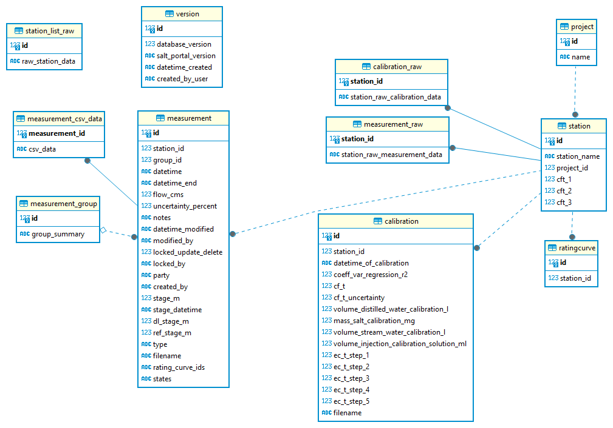

# Salt Portal Backup

[](https://pypi.org/project/salt-portal-backup)
[](https://pypi.org/project/salt-portal-backup)

-----

Backup projects, stations, calibrations and measurements from Salt Portal to a SQLite database.

Disclaimer: This project is not affiliated, associated, authorized, endorsed by, or in any way 
connected with Fathom Scientific Ltd, the provider of the Salt Portal.


## Table of Contents

- [Installation as package](#installation-as-package)
  - [Usage in python code](#usage-in-python-code)
  - [Usage as CLI](#usage-as-cli)
- [Download Windows executable](#download-windows-executable)
  - [Usage CLI](#usage-cli)
- [Building the pyinstaller exe](#building-the-pyinstaller-exe)
- [Database schema](#database-schema)
- [License](#license)

## Installation as package

```console
pip install salt-portal-backup
```

### Usage in python code

```python
from salt_portal_backup import run_backup

# without providing path to the database file
# backup will be stored in the user home directory
# with name salt_portal_yyyymmdd_hhmmss.db where yyyymmdd_hhmmss
# is the current date and time
run_backup(username='myusername', password='mypassword')

# provide location for the backup adding database_path keyword
# example below will create the my_backup.db database in the current
# working directory of the python session
run_backup(username='myusername', password='mypassword', 
           database_path='my_backup.db')
```

### Usage as CLI

Run in the environment where salt-portal-backup is installed:

```console
python -m salt_portal_backup.backup --help
```

## Download Windows executable

A windows stand-alone executable made with pyinstaller is available under [Releases](https://github.com/rhkarls/salt-portal-backup/releases) on Github.

### Usage CLI

Interaction with the CLI is the same was when calling the python script.

```console
salt_portal_backup.exe --help

Usage: salt_portal_backup.exe [OPTIONS]

  Backup projects, stations, calibrations and measurements from Salt Portal to
  a SQLite database.

Options:
  -u, --username TEXT         The Salt Portal login username. Will be prompted
                              if not provided.
  -p, --password TEXT         The Salt Portal login password. Will be prompted
                              if not provided.
  -o, --output_database TEXT  Path to the SQLite database to store the backup
                              in. The database is created if not excisting,
                              and it is recommended to use a new database for
                              each backup. If not provided, the database will
                              be created in the users home folder and named
                              with the current date and time time.
  --version                   Show the version and exit.
  --help                      Show this message and exit.

```

Example output, when calling without any options:

```console
salt_portal_backup.exe
Salt Portal username: myusername
Salt Portal password: (input is hidden)
Backup to C:\Users\myusername\salt_portal_20240826_135932.db
 projects:  33%|████████████████████████▎                                                | 3/9 [01:25<02:31, 25.22s/it]
 station in project:  12%|███████▉                                                       | 1/8 [00:01<00:11,  1.66s/it]
 measurement at station:  34%|███████████████████▍                                     | 17/50 [00:10<00:16,  1.96it/s]
```

## Building the pyinstaller exe

```console
pyinstaller src/salt_portal_backup/backup.py --onefile --name salt_portal_backup --icon static/icon-256.ico
```

## Database schema



## License

`salt-portal-backup` is distributed under the terms of the [BSD-3-Clause](https://spdx.org/licenses/BSD-3-Clause.html) license.
